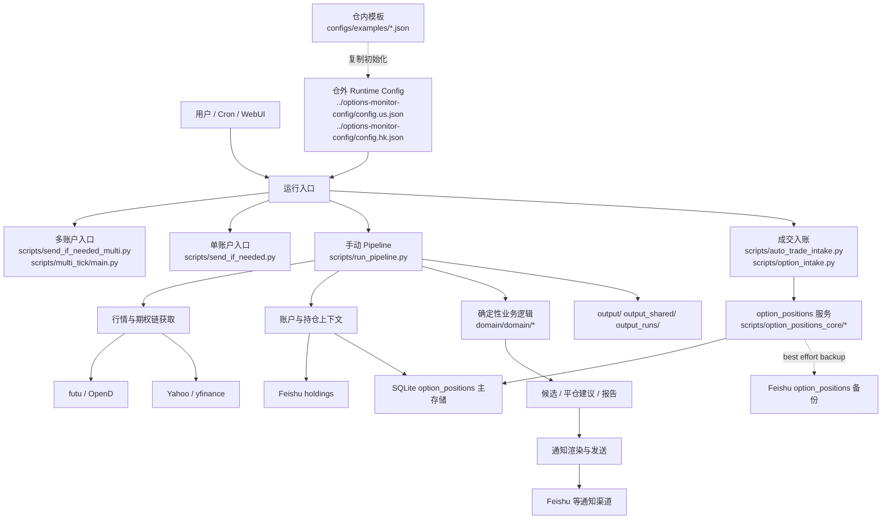

# options-monitor

期权监控与提醒工具，面向 Sell Put / Covered Call 工作流。支持美股/港股、多账户、定时扫描、候选筛选排序、平仓建议、成交自动入账，以及无候选时的监控心跳通知。

这份 README 只解决 6 个问题：

1. 这个项目现在是怎么工作的
2. 首次部署要准备什么
3. 配置文件应该放哪里
4. 数据源和存储边界是什么
5. 日常最常用的命令有哪些
6. 出问题时先去哪里看

更细的配置契约、字段定义、运维流程和测试约定，统一放在文末导航里。

## 你能用它做什么

- 扫描 `symbols` 中配置的标的期权链
- 按 DTE、行权价、收益门槛、流动性和事件标注筛选候选
- 为 Sell Put 检查现金担保能力
- 为 Covered Call 检查可覆盖股数
- 基于 open short put / short call 生成平仓建议
- 维护 `option_positions`，支持人工录入和自动成交入账
- 输出候选 CSV、摘要、提醒文本和运行状态

## 当前系统边界



最重要的几条边界：

- `domain/` 放确定性业务逻辑，尽量不直接做外部 IO。
- `scripts/` 放运行入口、适配器、报表、外部服务调用和运维脚本。
- `holdings` 仍然来自 Feishu。
- `option_positions` 现在是 `SQLite primary + Feishu best-effort backup`。
- 真实 runtime config 推荐放在仓外，仓内只保留模板。

## 5 分钟跑通

### 1) 安装依赖

```bash
git clone <repo-url> options-monitor
cd options-monitor
./run_watchlist.sh
```

如果你想手动装环境：

```bash
python3 -m venv .venv
./.venv/bin/pip install -U pip
./.venv/bin/pip install -r requirements.txt
```

### 2) 准备 runtime config

线上推荐放仓外：

```bash
mkdir -p ../options-monitor-config
cp configs/examples/config.example.us.json ../options-monitor-config/config.us.json
cp configs/examples/config.example.hk.json ../options-monitor-config/config.hk.json
```

开发机临时跑也可以直接复制到仓内：

```bash
cp configs/examples/config.example.us.json config.us.json
```

### 3) 准备 Feishu 凭证文件

如果需要 holdings 或 `option_positions` Feishu 备份：

```bash
mkdir -p secrets
cp configs/examples/portfolio.feishu.example.json secrets/portfolio.feishu.json
```

然后在运行配置里保持：

```json
{
  "portfolio": {
    "pm_config": "secrets/portfolio.feishu.json",
    "source": "auto",
    "source_by_account": {
      "lx": "futu",
      "sy": "holdings"
    }
  }
}
```

`portfolio.source` 支持 `auto` / `futu` / `holdings`。
如果不同账户要走不同来源，可以用 `portfolio.source_by_account` 做覆盖，回退顺序是：

1. `source_by_account[account]`
2. `source`
3. `auto`

### 4) 校验配置

```bash
./.venv/bin/python scripts/validate_config.py --config config.us.json
```

或仓外配置：

```bash
./.venv/bin/python scripts/validate_config.py --config ../options-monitor-config/config.us.json
./.venv/bin/python scripts/validate_config.py --config ../options-monitor-config/config.hk.json
```

### 5) 跑一次完整 pipeline

```bash
./.venv/bin/python scripts/run_pipeline.py --config config.us.json
```

只想快速验证扫描链路，不拉上下文：

```bash
./.venv/bin/python scripts/run_pipeline.py --config config.us.json --no-context
```

### 6) 看输出

```bash
ls output/reports
cat output/reports/symbols_notification.txt
```

## 配置应该放哪里

日常只维护 canonical runtime config：

- `../options-monitor-config/config.us.json`
- `../options-monitor-config/config.hk.json`

仓内 `configs/examples/*.json` 只作为模板，不作为线上真源。

真实 Feishu 凭证推荐放这里：

- `secrets/portfolio.feishu.json`
- `/opt/options-monitor/secrets/portfolio.feishu.json`

`pm_config` 默认查找顺序见 [scripts/config_loader.py](scripts/config_loader.py)：

1. `secrets/portfolio.feishu.json`
2. `/opt/options-monitor/secrets/portfolio.feishu.json`
3. `../portfolio-management/config.json`

多账户列表统一写在运行配置顶层 `accounts`，例如：

```json
{
  "accounts": ["lx", "sy"]
}
```

更多配置规则见 [CONFIGS.md](CONFIGS.md) 和 [CONFIGURATION_GUIDE.md](CONFIGURATION_GUIDE.md)。

## 数据源和存储边界

### 行情与期权链

- `futu`：通过 OpenD / Futu API 获取行情、期权链、合约乘数等数据
- `yahoo`：可作为美股降级来源
- 部分本地扩展流程可能还会依赖 Finnhub 等第三方数据源

常用 futu / OpenD 检查：

```bash
./.venv/bin/python scripts/doctor_futu.py --symbols NVDA 0700.HK
./.venv/bin/python scripts/opend_watchdog.py
./.venv/bin/python scripts/doctor_opend_required_fields.py --symbols NVDA 00700.HK
```

### holdings

- 仍然从 Feishu `holdings` 表读取
- 用于现金、股票持仓、成本价、covered call 可覆盖股数等上下文
- 当 `portfolio.source=holdings`，或 `portfolio.source_by_account[账户]=holdings` 时，账户上下文会强制走 holdings
- 当 `portfolio.source=auto` 时，会优先尝试 futu 账户上下文，失败后回退到 holdings

### option_positions

`option_positions` 现在不是 Feishu-only 了，而是：

- SQLite 主存储
- Feishu 可选备份

当前行为：

- 默认 SQLite 路径：`output_shared/state/option_positions.sqlite3`
- 可通过 `pm_config.option_positions.sqlite_path` 覆盖
- 所有 steady-state 读取默认走 SQLite
- `create/update` 先写 SQLite，再尽力同步 Feishu
- 如果 SQLite 为空且 Feishu `option_positions` 已配置，首次启动会自动从 Feishu bootstrap
- 如果 Feishu 备份失败，主流程仍成功，失败状态会记录在 SQLite

补偿备份失败记录：

```bash
./.venv/bin/python scripts/option_positions.py sync-backup --dry-run
./.venv/bin/python scripts/option_positions.py sync-backup
```

### 通知发送

常见通知目标配置在 runtime config 的 `notifications` 中。

安全建议：

- 本地调试优先用 `--no-send`
- 没确认前不要把生产群聊作为测试 target

## 日常最常用的命令

### 多账户 tick

这是当前主入口。

```bash
./.venv/bin/python scripts/send_if_needed_multi.py \
  --config ../options-monitor-config/config.us.json \
  --market-config us \
  --accounts lx sy
```

港股：

```bash
./.venv/bin/python scripts/send_if_needed_multi.py \
  --config ../options-monitor-config/config.hk.json \
  --market-config hk \
  --accounts lx sy
```

这个入口会做：

- scheduler 判断
- required data 获取
- portfolio / option_positions context 构建
- Sell Put / Covered Call 扫描
- 平仓建议附加
- 消息渲染与发送

### 单账户入口

```bash
./.venv/bin/python scripts/send_if_needed.py --config config.us.json
```

### 单次 pipeline

```bash
./.venv/bin/python scripts/run_pipeline.py --config config.us.json
```

只跑到某个阶段：

```bash
./.venv/bin/python scripts/run_pipeline.py --config config.us.json --stage fetch
./.venv/bin/python scripts/run_pipeline.py --config config.us.json --stage scan
./.venv/bin/python scripts/run_pipeline.py --config config.us.json --stage alert
./.venv/bin/python scripts/run_pipeline.py --config config.us.json --stage notify
```

### Watchlist 管理

```bash
./.venv/bin/python scripts/watchlist.py --config config.us.json list
./.venv/bin/python scripts/watchlist.py --config config.us.json add TSLA --put --use put_base --limit-exp 8
./.venv/bin/python scripts/watchlist.py --config config.us.json add AAPL --call --accounts lx
./.venv/bin/python scripts/watchlist.py --config config.us.json edit NVDA --set sell_put.min_strike=145 --set sell_put.max_strike=160
./.venv/bin/python scripts/watchlist.py --config config.us.json rm TSLA
```

### option_positions 维护

查看：

```bash
./.venv/bin/python scripts/option_positions.py list --market 富途 --account lx --status open
```

新增：

```bash
./.venv/bin/python scripts/option_positions.py add \
  --account lx \
  --symbol 0700.HK \
  --option-type put \
  --side short \
  --contracts 1 \
  --currency HKD \
  --strike 420 \
  --multiplier 100 \
  --exp 2026-04-29 \
  --dry-run
```

平仓：

```bash
./.venv/bin/python scripts/option_positions.py buy-close \
  --record-id <record_id> \
  --contracts 1 \
  --dry-run
```

补同步：

```bash
./.venv/bin/python scripts/option_positions.py sync-backup --dry-run
```

### 成交入账

解析成交消息：

```bash
./.venv/bin/python scripts/cli/parse_option_message_cli.py --text "<成交消息>"
```

聊天文本入账：

```bash
./.venv/bin/python scripts/option_intake.py --market 富途 --text "<成交消息>" --dry-run
./.venv/bin/python scripts/option_intake.py --market 富途 --text "<成交消息>" --apply
```

自动成交入账本地回放：

```bash
python3 scripts/auto_trade_intake.py \
  --config config.us.json \
  --mode dry-run \
  --deal-json configs/examples/auto_trade_intake.open.example.json
```

平仓回放：

```bash
python3 scripts/auto_trade_intake.py \
  --config config.us.json \
  --mode dry-run \
  --deal-json configs/examples/auto_trade_intake.close.example.json
```

### 平仓建议

单独生成报告，不发消息：

```bash
./.venv/bin/python scripts/close_advice.py \
  --config config.us.json \
  --context output/state/option_positions_context.json \
  --required-data-root output \
  --output-dir output/reports
```

## 业务口径摘要

### Sell Put

- 行权价必须低于当前股价，并落在配置允许区间内
- `min_dte <= dte <= max_dte`
- 现金担保金额不能超过账户可用额度
- 同时检查年化净收益率、单笔净收入、流动性和价差

### Covered Call

- 必须有足够股票覆盖 short call
- 可用股数会扣除已被其他 short call 锁定的部分
- 同时检查行权价、DTE、收益率、单笔净收入和流动性

### 平仓建议

- 只评估 `option_positions` 中仍 open 的 short put / short call
- 不处理 long option
- 不做自动下单
- 不会自动写回 `option_positions`
- 开仓权利金必须来自 `premium` 字段，或 `note` 中的 `premium_per_share`

更细的筛选、排序、拒绝原因和字段契约见 [docs/candidate_strategy.md](docs/candidate_strategy.md)。

## 输出和排障先看哪里

### 最常看的输出目录

- `output/raw/`：原始行情抓取结果
- `output/parsed/`：标准化 required data CSV
- `output/reports/`：候选 CSV、摘要、提醒文本
- `output/state/`：单账户状态缓存
- `output_shared/`：共享上下文和跨账户复用缓存
- `output_runs/<run_id>/`：多账户单次运行产物

### 多账户运行重点看

- `output_runs/<run_id>/accounts/<account>/`
- `output_runs/<run_id>/accounts/<account>/close_advice.csv`
- `output_runs/<run_id>/accounts/<account>/close_advice.txt`

快速定位：

```bash
find output_runs -maxdepth 3 -type f | sort | tail -40
```

### option_positions context 的来源标记

这些标记会写入账户级 context JSON：

- `context_source=shared_refresh`：本 tick 首次刷新共享上下文
- `context_source=shared_slice`：从共享上下文按账户切片复用
- `context_source=account_cache`：命中账户本地缓存
- `context_source=direct_fetch`：回退到账户级直接拉取

### 健康检查

```bash
./.venv/bin/python scripts/healthcheck.py --config config.us.json --accounts lx sy
```

### 常见问题先查

- OpenD / futu 连不上：先跑 `scripts/opend_watchdog.py`
- 没候选：先看 `output/reports/` 和 required data
- 现金口径不对：先看 holdings 和 `option_positions_context.json`
- 平仓建议为空：先确认 `option_positions` 是否有 open short 仓位，并且 `premium` 或 `note.premium_per_share` 已填写
- 自动平仓/自动入账不生效：先用对应 dry-run 样例回放
- Feishu 备份失败：先跑 `scripts/option_positions.py sync-backup --dry-run`

## 通知行为

- 有候选：发送候选提醒
- 有 strong / medium 平仓建议：追加到账户提醒
- 无候选但监控正常触发：发送心跳文案
- `quiet_hours`、`--no-send`、缺通知目标等门控仍会阻止发送

## 文档导航

- [CONFIGS.md](CONFIGS.md)：配置真源、派生配置同步、配置门禁
- [CONFIGURATION_GUIDE.md](CONFIGURATION_GUIDE.md)：配置字段说明
- [RUNBOOK.md](RUNBOOK.md)：运维巡检、排障和应急操作
- [docs/candidate_strategy.md](docs/candidate_strategy.md)：候选筛选与排序契约
- [docs/required_data_schema.md](docs/required_data_schema.md)：required data 字段契约
- [tests/README.md](tests/README.md)：测试分层和新增测试规则

## 风险提示

本工具只做监控、筛选和提醒，不构成投资建议。期权交易风险较高，任何下单都需要自行复核标的、价格、仓位、保证金、流动性和事件风险。
