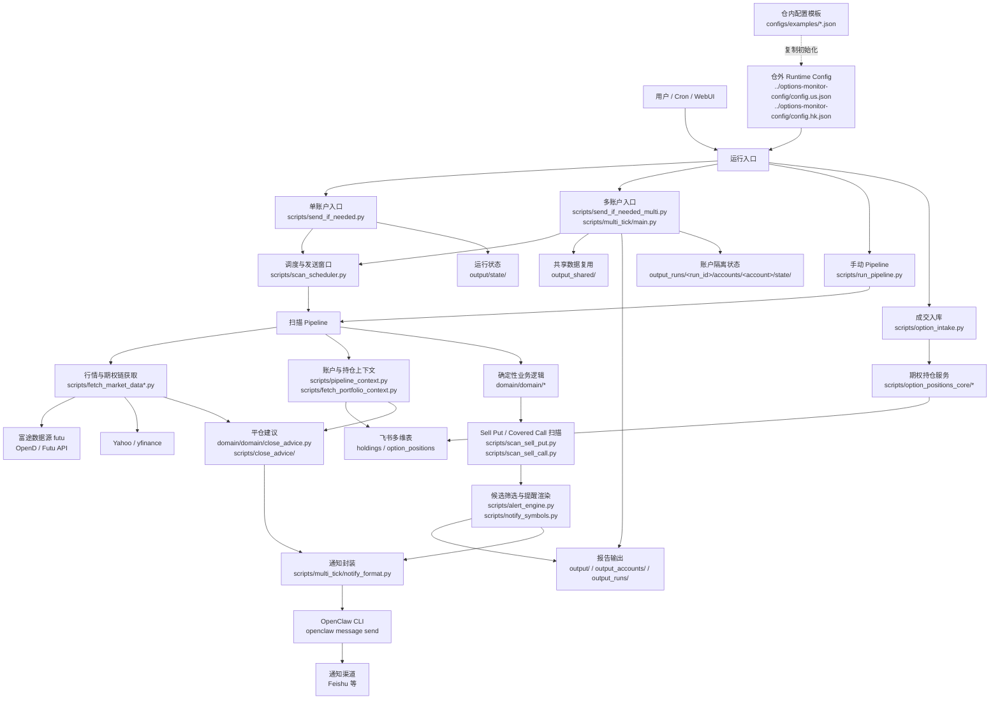

# options-monitor

期权监控与提醒工具，面向 Sell Put / Covered Call（日常卖 Put、备兑卖 Call）工作流。支持美股/港股、多账户、定时扫描、候选筛选排序、提醒发送，以及无候选时的监控心跳通知。

本文是用户手册，只覆盖安装、配置、5 分钟跑通、常用命令和排障入口。策略细节、数据 schema、配置契约和运维流程分别见文末导航。

## 你能用它做什么

- 扫描 `symbols` 中配置的标的期权链。
- 按 DTE、行权价、收益门槛、流动性和事件标注筛选候选。
- 为 Sell Put 检查现金担保能力。
- 为 Covered Call 检查可覆盖股数。
- 根据已持仓 short put/call 的已锁定收益、剩余 DTE 和剩余收益年化生成平仓建议。
- 生成候选 CSV、摘要、提醒文本。

## 项目架构



核心边界：

- `domain/` 放确定性业务逻辑和跨入口共享契约，尽量不直接做外部 IO。
- `scripts/` 放运行入口、适配器、报表渲染、外部服务调用和运维脚本。
- `configs/examples/` 只放模板；真实线上配置推荐放在仓库外，不提交 Git。
- `output*` 目录是运行产物和状态缓存，不作为源码维护。

## 筛选标的业务策略

系统的筛选目标不是“找最高收益率”，而是在账户约束、行权价边界、到期时间、流动性和风险事件都可接受的前提下，挑出最值得人工复核的 Sell Put / Covered Call 候选。

整体流程：

1. 先从配置里的 `symbols` 读取需要监控的标的、账户和策略方向，例如 Sell Put、Covered Call，或两者同时开启。
2. 拉取对应标的的行情、期权链、合约乘数、DTE、bid/ask/mid、成交量、未平仓量、IV、Delta 等基础数据。
3. 结合账户上下文做可行性检查：Sell Put 看现金担保能力，Covered Call 看可覆盖股数。
4. 对可行合约应用硬性筛选：到期时间、行权价范围、收益门槛、单笔净收入、流动性和价差。
5. 对通过筛选的候选排序并生成提醒；如果没有候选，也会在应通知窗口内发送“本轮无候选”的心跳消息。

Sell Put 主要关注：

- 行权价需要低于当前股价，并落在配置允许的绝对或相对区间内。
- 到期时间需要满足 `min_dte <= dte <= max_dte`。
- 现金担保金额不能超过账户可用现金和已占用保证金后的可用额度。
- 年化净收益率需要达到配置阈值，必要时还会检查单笔净收入。
- 流动性需要满足最小未平仓量、最小成交量和最大价差比例要求。

Covered Call 主要关注：

- 合约需要是 call，并且账户里有足够股票覆盖卖出张数。
- 可用股数会扣除已被其他 short call 占用的部分。
- 行权价、到期时间、年化权利金收益率、单笔净收入需要满足配置阈值。
- 排序时会优先看年化权利金收益率，同时保留到期被行权时的整体收益视角，便于人工复核。

平仓建议主要关注：

- 只评估 `option_positions` 中仍 open 的 short put / short call，不处理 long option，也不做亏损止损建议。
- 开仓权利金必须来自持仓表字段 `premium`，或 `note` 中的 `premium_per_share`；系统不会从历史行情反推开仓价。
- 当前平仓价优先使用本轮 required data 里的 `mid`，匹配不到时可按配置 best-effort 使用 OpenD 取报价；报价失败不会阻断原有扫描。
- 核心指标是已锁定收益比例、剩余 DTE 和剩余收益年化。short put 的剩余收益年化约为 `close_mid / strike / dte * 365`，short call 约为 `close_mid / spot / dte * 365`。
- 强度分为 strong / medium / weak / optional / none。默认只把 strong 和 medium 追加到通知，weak 和 optional 主要用于 CSV 复核。
- 平仓建议只提醒，不自动下单、不写回 `option_positions`。

风险事件与排序：

- 财报、除权除息等事件默认以提示为主，命中时在报告里标注，不默认硬拒绝。
- 当前全局流动性/价差硬筛选只保留 `min_open_interest`、`min_volume`、`max_spread_ratio`。
- 排序保持确定性：Sell Put 主要按现金基础年化净收益率排序，Covered Call 主要按年化权利金收益率排序，净收入作为次级参考。
- 分层输出里的“激进 / 中性 / 保守”只是展示多样化策略，不替代硬性筛选规则。

更详细的字段契约、拒绝原因和实现映射见 [docs/candidate_strategy.md](docs/candidate_strategy.md)。

## 安装

要求：

- Python 3.10+
- 能访问行情源，例如 `futu`（富途 OpenD / Futu API）或 Yahoo，按你的配置决定
- 如需通知或持仓上下文，需要准备对应的飞书/portfolio-management 配置

首次安装：

```bash
git clone <repo-url> options-monitor
cd options-monitor
./run_watchlist.sh
```

`run_watchlist.sh` 会自动创建 `.venv` 并安装 `requirements.txt` 中的依赖。

如果你只想手动准备环境：

```bash
python3 -m venv .venv
./.venv/bin/pip install -U pip
./.venv/bin/pip install -r requirements.txt
```

## 配置

线上推荐将真实运行配置放在仓库外管理，仓库内只保留 `configs/examples/*.json` 模板。例如：

```text
../options-monitor-config/config.us.json
../options-monitor-config/config.hk.json
/opt/options-monitor/secrets/portfolio.feishu.json
```

初始化时可从模板复制到仓外路径：

```bash
mkdir -p ../options-monitor-config /opt/options-monitor/secrets
cp configs/examples/config.example.us.json ../options-monitor-config/config.us.json
cp configs/examples/config.example.hk.json ../options-monitor-config/config.hk.json
cp configs/examples/portfolio.feishu.example.json /opt/options-monitor/secrets/portfolio.feishu.json
```

开发机临时运行也可以复制到仓内同名文件；这些文件已被 `.gitignore` 忽略，不提交 Git。

日常只编辑 canonical runtime config：

- `../options-monitor-config/config.us.json`
- `../options-monitor-config/config.hk.json`

WebUI 配置中心默认读取当前项目目录同级的 `../options-monitor-config`，例如服务跑在 `options-monitor-prod` 时，会读取 `../options-monitor-config/config.us.json` 和 `../options-monitor-config/config.hk.json`。若线上真实路径不同，请在启动 WebUI 时显式设置：

```bash
OM_WEBUI_CONFIG_DIR=../options-monitor-config
# 或分别指定
OM_WEBUI_CONFIG_US=/path/to/config.us.json
OM_WEBUI_CONFIG_HK=/path/to/config.hk.json
```

WebUI 不应默认落到 `options-monitor-prod/config.us.json` / `options-monitor-prod/config.hk.json`，那通常只是代码发布目录下的兼容路径，不应作为 canonical runtime config。

多账户列表统一写在配置的顶层 `accounts` 字段中，例如 `["lx", "sy"]`。没有显式传 `--accounts` 的辅助脚本会优先使用这个字段。

派生配置的来源、同步和禁止手工维护规则见 `CONFIGS.md`。

配置校验：

```bash
./.venv/bin/python scripts/validate_config.py --config ../options-monitor-config/config.us.json
./.venv/bin/python scripts/validate_config.py --config ../options-monitor-config/config.hk.json
```

可选启用平仓建议：

```json
{
  "close_advice": {
    "enabled": true,
    "max_items_per_account": 5,
    "max_spread_ratio": 0.4,
    "notify_levels": ["strong", "medium"],
    "strong_remaining_annualized_max": 0.08,
    "medium_remaining_annualized_max": 0.12
  }
}
```

字段说明：

- `enabled`: 默认 `false`；开启后，多账户 tick 会为每个账户生成平仓建议。
- `notify_levels`: 默认只通知 `strong` 和 `medium`；`weak`、`optional` 仍会写入 CSV。
- `max_spread_ratio`: bid/ask 价差过宽时不提醒，但会在 CSV 的 `data_quality_flags` 标记。
- `strong_remaining_annualized_max` / `medium_remaining_annualized_max`: 剩余收益年化上限，用于校准建议强度。

## 外部服务与凭证配置

本项目会按配置使用外部服务。首次部署时，建议先按下面清单准备好本地配置和凭证；所有真实凭证都不要提交到 Git。

### 1) 飞书多维表（持仓与期权占用）

用途：

- 读取 `holdings` 表：现金、股票持仓、成本价，用于 Sell Put 现金余量和 Covered Call 可覆盖股数。
- 读取/维护 `option_positions` 表：已卖出的 put/call 占用，用于 cash-secured put 和 covered call 风控。

配置位置：

- runtime config 的 `portfolio.pm_config`。
- 新部署推荐指向仓外的 `/opt/options-monitor/secrets/portfolio.feishu.json`；可从 `configs/examples/portfolio.feishu.example.json` 复制后填写。
- 旧部署仍可继续使用 `../portfolio-management/config.json`，当前脚本默认值也保留这个兼容路径。

需要准备：

- Feishu App 的 `app_id` / `app_secret`。
- `holdings` 表的 `app_token/table_id`。
- `option_positions` 表的 `app_token/table_id`。
- 表字段需要符合 [CONFIGURATION_GUIDE.md](CONFIGURATION_GUIDE.md) 里的字段说明。

注意：

- 不要把 `app_secret`、tenant token、user token 写进仓库。
- `secrets/` 已被 `.gitignore` 忽略，适合放本地真实凭证。
- 写入飞书的操作，例如成交入库、自动关闭仓位，建议先用 `--dry-run`。

### 2) 富途数据源 futu（OpenD / Futu API 行情与期权链）

用途：

- 当标的配置里的 `fetch.source` 为 `futu` 时，通过本机 OpenD 网关和 Futu API 拉行情、期权链、合约乘数等数据。
- 旧配置里的 `fetch.source = "opend"` 仍兼容，但新配置建议统一写 `futu`。
- 港股期权通常依赖富途数据源；美股可按配置在 futu 和 Yahoo 之间选择或降级。

需要准备：

- 本机或服务器已启动 OpenD。
- 富途账户已登录，行情权限可用。
- 默认连接 `127.0.0.1:11111`；如需调整，在配置或脚本参数里设置 host/port。

常用检查：

```bash
./.venv/bin/python scripts/doctor_futu.py --symbols NVDA 0700.HK
./.venv/bin/python scripts/opend_watchdog.py
./.venv/bin/python scripts/doctor_opend_required_fields.py --symbols NVDA 00700.HK
```

### 3) Yahoo / yfinance（可选行情源）

用途：

- 当 `fetch.source` 为 `yahoo` 时，使用 yfinance 拉取美股行情和期权链。
- 也可作为富途/OpenD 不可用时的美股降级来源。

注意：

- 当前示例配置不需要 Yahoo API Key。
- Yahoo/yfinance 可能被限流；生产监控中建议保留富途/OpenD 健康检查和降级策略。

### 4) Finnhub 等第三方行情源（如启用）

用途：

- 如果你的本地 `portfolio-management` 或自定义行情流程启用了 Finnhub，需要单独准备 API Key。
- 当前仓库示例配置默认不强制 Finnhub；只有在你自己的配置或外部依赖里引用时才需要。

建议：

- 将 Finnhub API Key 放在外部服务自己的本地配置或环境变量中。
- 不要把 API Key 写入 `config.*.json` 示例文件或提交到 Git。

### 5) 通知发送目标

用途：

- 发送候选提醒、无候选心跳、OpenD 告警等消息。

配置位置：

- `options-monitor-config` runtime config 的 `notifications`，例如 `../options-monitor-config/config.us.json`。

常见字段：

- `channel`: 发送通道，当前常用为 `feishu`；也可以使用本机 `openclaw` 已支持的其他通道。
- `target`: 发送目标，例如 `user:open_id` 或 `chat:chat_id`。
- `quiet_hours_beijing`: 可选，北京时间免打扰窗口；不需要时不要写 `null`，直接省略。
- `cash_footer_accounts` / `cash_footer_timeout_sec` / `cash_snapshot_max_age_sec`: 可选，现金摘要账户与查询参数。

兼容字段：

- `include_cash_footer`: 仅旧 `scripts/run_pipeline.py` 会读取；多账户主流程不把它作为发送开关，主示例不再配置。
- 不再推荐配置 `enabled` / `mode`，当前主流程不读取它们作为行为开关。

安全建议：

- 本地调试时优先使用 `--no-send` 或只查看 `output/reports/symbols_notification.txt`。
- 没确认前不要把生产群聊作为测试 target。

## 5 分钟跑通

下面命令使用仓内 `config.us.json` 作为开发机简写；生产环境请替换为相对项目目录的 `options-monitor-config` 路径，例如 `../options-monitor-config/config.us.json`。

1. 准备配置：

```bash
cp configs/examples/config.example.us.json config.us.json
```

2. 跑一次完整 pipeline：

```bash
./.venv/bin/python scripts/run_pipeline.py --config config.us.json
```

3. 查看输出：

```bash
ls output/reports
cat output/reports/symbols_notification.txt
```

4. 如果只想快速验证流程，不拉持仓上下文：

```bash
./.venv/bin/python scripts/run_pipeline.py --config config.us.json --no-context
```

## 常用工作流

### 单次 symbols 扫描

```bash
OPTIONS_MONITOR_CONFIG=config.us.json ./run_watchlist.sh
OPTIONS_MONITOR_CONFIG=config.hk.json ./run_watchlist.sh
```

### 多账户 tick

```bash
./.venv/bin/python scripts/send_if_needed_multi.py --config ../options-monitor-config/config.us.json --market-config us --accounts lx sy
./.venv/bin/python scripts/send_if_needed_multi.py --config ../options-monitor-config/config.hk.json --market-config hk --accounts lx sy
```

这个入口会按 scheduler 判断是否需要扫描和通知；多账户运行会复用同一 tick 的 required data 与持仓上下文缓存。

当前 scheduler 只在交易日的交易时段内触发：开盘后 30 分钟通知一次，之后每小时通知一次，收盘前 10 分钟通知一次。港股午休等 `market_break_start` / `market_break_end` 时段会跳过。

### 单账户定时入口

```bash
./.venv/bin/python scripts/send_if_needed.py --config config.us.json
```

### Watchlist 管理

```bash
./.venv/bin/python scripts/watchlist.py --config config.us.json list
./.venv/bin/python scripts/watchlist.py --config config.us.json add TSLA --put --use put_base --limit-exp 8
./.venv/bin/python scripts/watchlist.py --config config.us.json add AAPL --call --accounts lx
./.venv/bin/python scripts/watchlist.py --config config.us.json edit NVDA --set sell_put.min_strike=145 --set sell_put.max_strike=160
./.venv/bin/python scripts/watchlist.py --config config.us.json rm TSLA
```

### 成交消息入库

先解析：

```bash
./.venv/bin/python scripts/cli/parse_option_message_cli.py --text "<成交消息>"
```

默认 dry-run：

```bash
./.venv/bin/python scripts/option_intake.py --market 富途 --text "<成交消息>" --dry-run
```

确认无误后再写入：

```bash
./.venv/bin/python scripts/option_intake.py --market 富途 --text "<成交消息>" --apply
```

自动交易入账本地回放样例：

```bash
python3 scripts/auto_trade_intake.py \
  --config config.us.json \
  --mode dry-run \
  --deal-json configs/examples/auto_trade_intake.open.example.json
```

平仓样例：

```bash
python3 scripts/auto_trade_intake.py \
  --config config.us.json \
  --mode dry-run \
  --deal-json configs/examples/auto_trade_intake.close.example.json
```

说明：

- `auto_trade_intake.open.example.json` 可直接 dry-run 预览，不依赖飞书凭证。
- `auto_trade_intake.close.example.json` 在没有对应 open 仓位时会返回 `close_match_not_found` 或仓位不足，这是预期行为；要验证平仓 patch，需要 `option_positions` 中已有匹配仓位。

## CLI 常用命令

### Sell Put 扫描

```bash
./.venv/bin/python scripts/cli/scan_sell_put_cli.py \
  --symbols AAPL \
  --min-annualized-net-return 0.08 \
  --min-net-income 50 \
  --min-open-interest 100 \
  --min-volume 10 \
  --max-spread-ratio 0.30 \
  --quiet
```

### Sell Call 扫描

```bash
./.venv/bin/python scripts/cli/scan_sell_call_cli.py \
  --symbols AAPL \
  --avg-cost 150 \
  --shares 100 \
  --min-annualized-net-return 0.08 \
  --min-net-income 50 \
  --min-open-interest 100 \
  --min-volume 10 \
  --max-spread-ratio 0.30 \
  --quiet
```

### 平仓建议

单独生成报告，不发送通知：

```bash
./.venv/bin/python scripts/close_advice.py \
  --config config.us.json \
  --context output/state/option_positions_context.json \
  --required-data-root output \
  --output-dir output/reports
```

输出：

- `close_advice.csv`: 全部可评估持仓和数据质量标记。
- `close_advice.txt`: 按 `notify_levels` 过滤后的 Markdown 提醒片段。

多账户 tick 下，输出位于 `output_runs/<run_id>/accounts/<account>/close_advice.csv` 和 `close_advice.txt`，并在 `close_advice.enabled=true` 时自动追加到账户通知。

### 只跑到某个阶段

```bash
./.venv/bin/python scripts/run_pipeline.py --config config.us.json --stage fetch
./.venv/bin/python scripts/run_pipeline.py --config config.us.json --stage scan
./.venv/bin/python scripts/run_pipeline.py --config config.us.json --stage alert
./.venv/bin/python scripts/run_pipeline.py --config config.us.json --stage notify
```

### 只重渲染已有候选

```bash
./.venv/bin/python scripts/cli/render_sell_put_alerts_cli.py --report-dir output/reports --top 5 --layered
./.venv/bin/python scripts/cli/render_sell_call_alerts_cli.py --report-dir output/reports --top 5 --layered
```

### 健康检查

```bash
./.venv/bin/python scripts/healthcheck.py --config config.us.json --accounts lx sy
```

## Trace 与输出定位

常看文件：

- `output/raw/`：原始行情抓取结果。
- `output/parsed/`：标准化 required data CSV。
- `output/reports/`：候选 CSV、摘要、提醒文本。
- `output/state/`：单账户状态缓存。
- `output_runs/<run_id>/`：多账户 tick 的单次运行产物。
- `output_runs/<run_id>/accounts/<account>/`：多账户下单个账户的报告和状态。
- `output_runs/<run_id>/accounts/<account>/close_advice.csv`：平仓建议明细。
- `output_runs/<run_id>/accounts/<account>/close_advice.txt`：追加到账户通知的平仓建议片段。

多账户运行时，可重点看：

```bash
find output_runs -maxdepth 3 -type f | sort | tail -40
```

上下文复用可观测标记会写入账户级 context JSON：

- `context_source=shared_refresh`：本 tick 首次刷新共享上下文。
- `context_source=shared_slice`：从共享上下文按账户切片复用。
- `context_source=account_cache`：命中账户本地缓存。
- `context_source=direct_fetch`：回退到账户级直接拉取。

## 通知行为

- 有候选：发送候选提醒。
- 有 strong/medium 平仓建议：追加到账户提醒；即使没有新开仓候选，也可触发账户消息。
- 无候选但监控正常触发：发送心跳文案 `监控正常触发：本轮无候选。`
- 调度触发点：交易日交易时段内，开盘后 30 分钟、之后每小时、收盘前 10 分钟。
- quiet hours / no-send / 缺通知目标等发送门控仍会阻止发送。

## 文档导航

- `CONFIGS.md`：配置真源、派生配置同步、配置门禁。
- `CONFIGURATION_GUIDE.md`：配置字段说明。
- `RUNBOOK.md`：运维巡检、排障和应急操作。
- `docs/candidate_strategy.md`：候选筛选、过滤、排序契约。
- `docs/required_data_schema.md`：required data 字段契约。
- `docs/GUARDRAILS.md`：仓库 guardrails。
- `tests/README.md`：测试分层和新增测试规则。

## 风险提示

本工具只做监控、筛选和提醒，不构成投资建议。期权交易风险较高，任何下单都需要自行复核标的、价格、仓位、保证金、流动性和事件风险。
